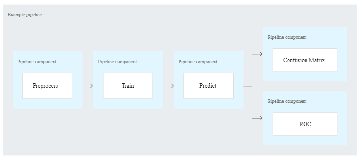

# AI Platform Pipeline

## Table of Content

1. Usage

2. Kubeflow

3. Tensorflow Extended

4. Billin

## Usage

*MLOps* is the practice of applying DevOps practices to help automate, manage, and audit ML workflows. AI Platform Pipelines helps you implement MLOps by providing a platform where you can orchestrate the steps in your workflow as a pipeline. ML pipelines are portable and reproducible definitions of ML workflows.

AI Platform Pipelines makes it easier to get started with MLOps by saving the difficulty of setting up Kubeflow Pipelines with TensorFlow Extended (TFX).

*Components*

*[Kubeflow](https://www.kubeflow.org/)* is an open source toolkit for running ML workloads on Kubernetes. The Kubeflow project is dedicated to making deployments of machine learning (ML) workflows on Kubernetes simple, portable and scalable.

*TFX* is an open source project that you can use to define your TensorFlow based ML workflows as a pipeline. TFX provides components that you can reuse to ingest and transform data, train and evaluate a model, deploy a trained model for inference, etc.

## Kubeflow

Basic workflow: 

1. Developing the code for each step in your workflow using your preferred language and tools
2. Creating a Docker container image for each step's code
3. Using Python to define your pipeline using the Kubeflow Pipelines SDK

Kubeflow provides support for distributed training with Tensorflow and Pytorch

## Tensorflow Extended(TFX)

A TFX pipeline is a sequence of components that implement an ML pipeline which is specifically designed for scalable, high-performance machine learning tasks. That includes modeling, training, serving inference, and managing deployments to online, native mobile, and JavaScript targets.

It has several components

- Tensorflow Data Validation(TFDV)

- Tensorflow Transform

- Tensorflow Model Analysis(TFMA)

- Tensorflow Serving

TFX can be used with Kubeflow on GCP.

## Billing

There is no charge for using AI Platform Pipelines. However, you do pay for any Google Cloud resources you use with AI Platform Pipelines.

